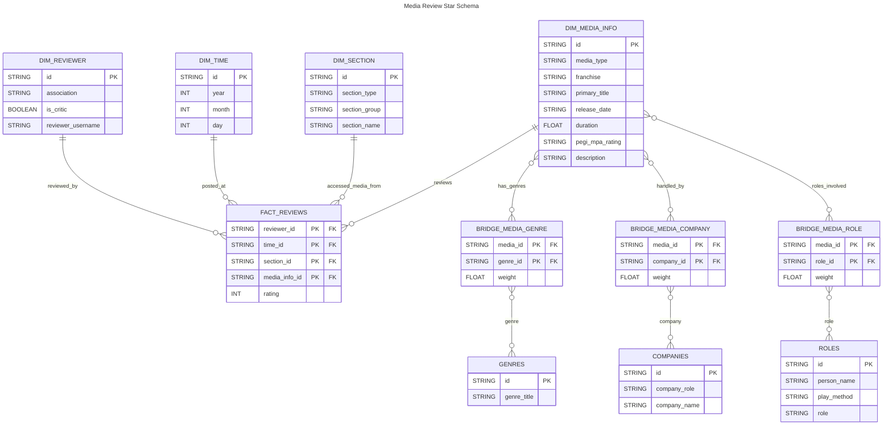

https://mermaid.live/edit

```mermaid
---
title: Media Review Star Schema
---
erDiagram
FACT_REVIEWS {
    STRING reviewer_id PK "FK" 
    STRING time_id PK "FK"
    STRING section_id PK "FK"
    STRING media_info_id PK "FK"
    INT rating
}

DIM_MEDIA_INFO {
    STRING id PK
    STRING media_type
    STRING franchise
    STRING primary_title
    STRING release_date
    FLOAT duration
    STRING pegi_mpa_rating
    STRING description
}

BRIDGE_MEDIA_COMPANY {
    STRING media_id PK "FK"
    STRING company_id PK "FK"
    FLOAT weight
}

COMPANIES {
    STRING id PK
    STRING company_role
    STRING company_name
}

BRIDGE_MEDIA_GENRE {
    STRING media_id PK "FK"
    STRING genre_id PK "FK"
    FLOAT weight
}

GENRES {
    STRING id PK
    STRING genre_title
}

BRIDGE_MEDIA_ROLE {
    STRING media_id PK "FK"
    STRING role_id PK "FK"
    FLOAT weight
}

ROLES {
    STRING id PK
    STRING person_name
    STRING play_method
    STRING role
}

DIM_REVIEWER {
    STRING id PK
    STRING association
    BOOLEAN is_critic
    STRING reviewer_username
}

DIM_TIME {
    STRING id PK
    INT year
    INT month
    INT day
}

DIM_SECTION {
    STRING id PK
    STRING section_type
    STRING section_group
    STRING section_name
}

DIM_REVIEWER ||--o{ FACT_REVIEWS : reviewed_by
DIM_MEDIA_INFO ||--o{ FACT_REVIEWS : reviews
DIM_TIME ||--o{ FACT_REVIEWS : posted_at
DIM_SECTION ||--o{ FACT_REVIEWS : accessed_media_from

DIM_MEDIA_INFO }o--o{ BRIDGE_MEDIA_GENRE : has_genres
BRIDGE_MEDIA_GENRE }o--o{ GENRES : genre
DIM_MEDIA_INFO }o--o{ BRIDGE_MEDIA_COMPANY : handled_by
BRIDGE_MEDIA_COMPANY }o--o{ COMPANIES : company
DIM_MEDIA_INFO }o--o{ BRIDGE_MEDIA_ROLE : roles_involved
BRIDGE_MEDIA_ROLE }o--o{ ROLES : role

```