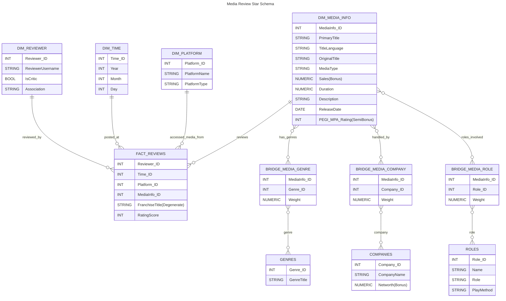

```mermaid
---
title: Media Review Star Schema
---
erDiagram
FACT_REVIEWS {
    INT Reviewer_ID
    INT Time_ID
    INT Platform_ID
    INT MediaInfo_ID
    STRING FranchiseTitle(Degenerate)
    INT RatingScore
}

DIM_MEDIA_INFO {
    INT MediaInfo_ID
    STRING PrimaryTitle
    STRING TitleLanguage
    STRING OriginalTitle
    STRING MediaType
    NUMERIC Sales(Bonus)
    NUMERIC Duration
    STRING Description
    DATE ReleaseDate
    INT PEGI_MPA_Rating(SemiBonus)
}


BRIDGE_MEDIA_COMPANY{
    INT MediaInfo_ID
    INT Company_ID
    NUMERIC Weight
}

COMPANIES {
    INT Company_ID
    STRING CompanyName
    NUMERIC Networth(Bonus)
}

BRIDGE_MEDIA_GENRE{
    INT MediaInfo_ID
    INT Genre_ID
    NUMERIC Weight
}
GENRES {
    INT Genre_ID
    STRING GenreTitle
}

BRIDGE_MEDIA_ROLE {
    INT MediaInfo_ID
    INT Role_ID
    NUMERIC Weight
}

ROLES{
    INT Role_ID
    STRING Name
    STRING Role
    STRING PlayMethod
}

DIM_REVIEWER {
    INT Reviewer_ID
    STRING ReviewerUsername
    BOOL IsCritic
    STRING Association
}

DIM_TIME {
   INT Time_ID
   INT Year
   INT Month
   INT Day
}

DIM_PLATFORM {
    INT Platform_ID
    STRING PlatformName
    STRING PlatformType
}


DIM_REVIEWER ||--o{ FACT_REVIEWS : reviewed_by
DIM_MEDIA_INFO ||--o{ FACT_REVIEWS : reviews
DIM_TIME ||--o{ FACT_REVIEWS : posted_at
DIM_PLATFORM ||--o{ FACT_REVIEWS : accessed_media_from

DIM_MEDIA_INFO }o--o{ BRIDGE_MEDIA_GENRE : has_genres
BRIDGE_MEDIA_GENRE }o--o{ GENRES : genre
DIM_MEDIA_INFO }o--o{ BRIDGE_MEDIA_COMPANY : handled_by
BRIDGE_MEDIA_COMPANY }o--o{ COMPANIES : company
DIM_MEDIA_INFO }o--o{ BRIDGE_MEDIA_ROLE : roles_involved
BRIDGE_MEDIA_ROLE }o--o{ ROLES : role

```
