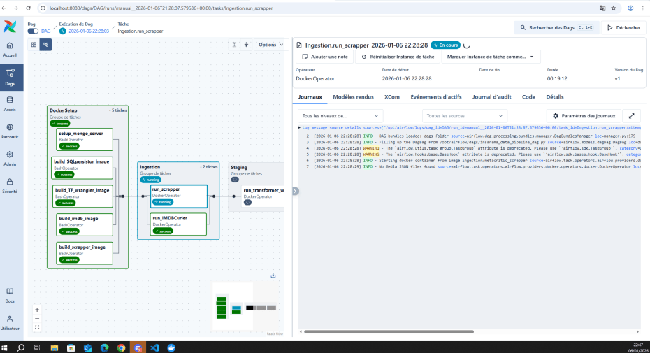
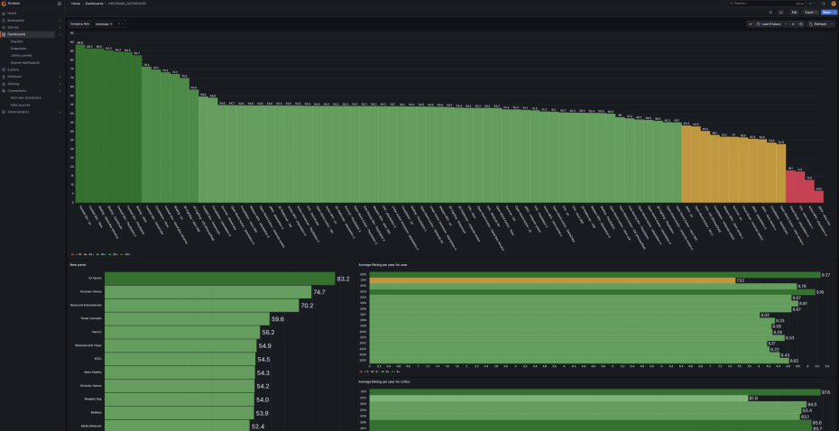
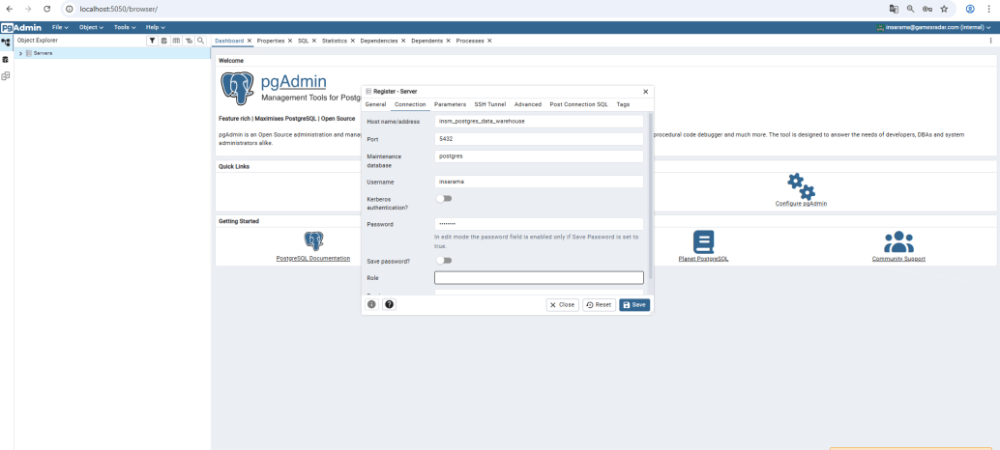
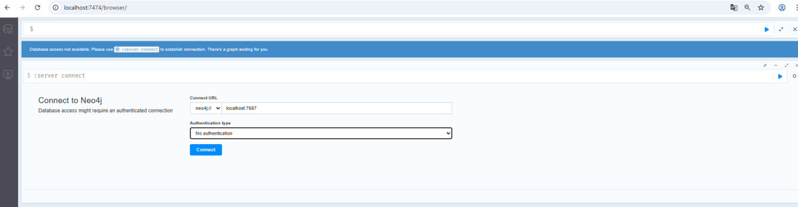
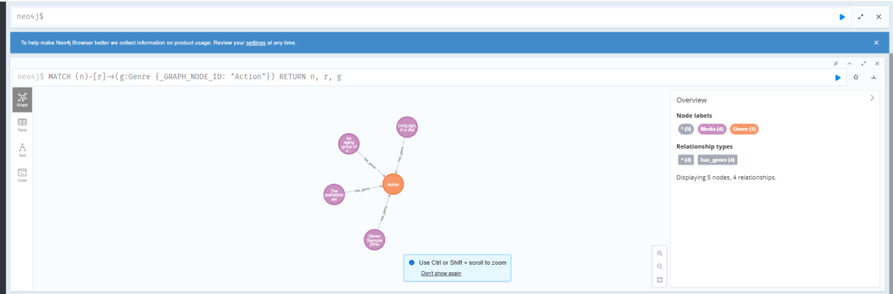
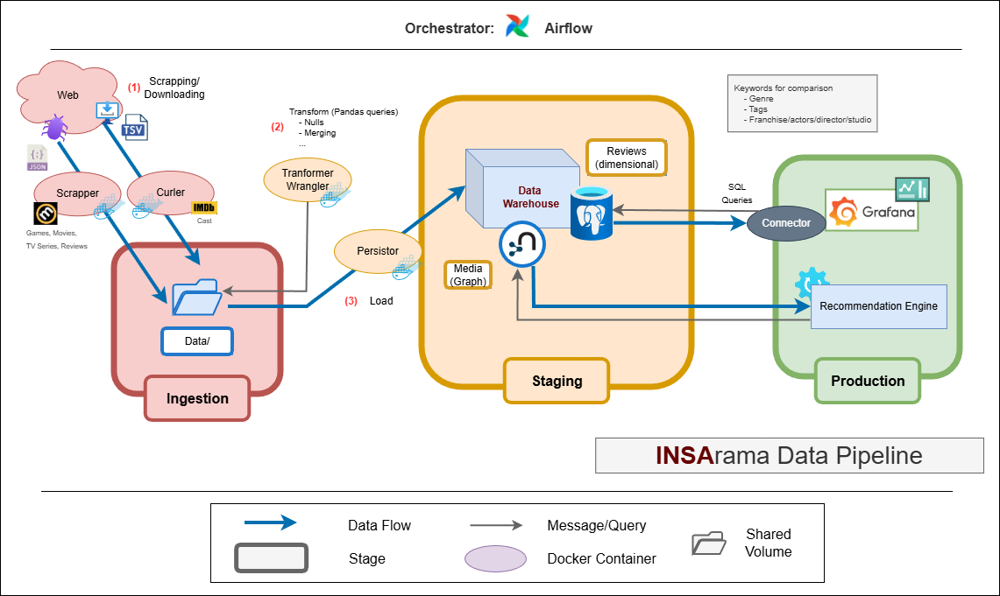
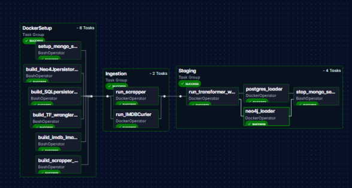
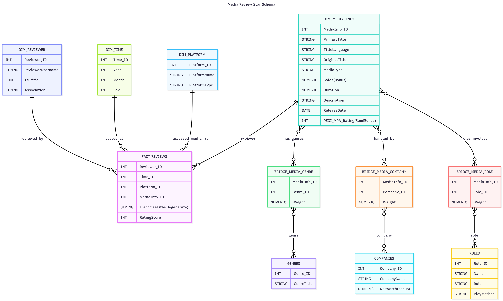

# DataEng 2025 INSArama Project

<center>

<span style="font-size: 150%;">

Project [DATA Engineering](https://www.riccardotommasini.com/courses/dataeng-insa-ot/) is provided by [INSA Lyon](https://www.insa-lyon.fr/).

</span>

</center>

## Students: 
- **Diego LARRAZ MARTIN** — diego.larraz-martin@insa-lyon.fr
- **Doha ES-SOUFI** — doha.es-soufi@insa-lyon.fr  
- **Jassir HABBA** — jassir.habba@insa-lyon.fr  

# 1. Introduction

## 1.1 Project Context and Objectives

Movies, TV series, and video games are now closely connected forms of entertainment. Users often move from one medium to another within the same genre, universe, or theme. Despite this convergence, data describing these media is usually stored and analyzed separately, which limits cross-media analysis and recommendation capabilities.

From a data engineering perspective, this project addresses the challenge of integrating heterogeneous multimedia datasets into a unified analytical system. These datasets differ in format, structure, semantics, and update frequency, requiring well-defined ingestion, transformation, and modeling strategies.

The main objective of this project is to design and implement a complete data engineering pipeline that collects raw multimedia data, cleans and enriches it, and makes it available for analytics and recommendations. The architecture follows a layered approach with a landing zone, a staging zone, and a production zone, ensuring data durability and reproducibility. All data movements and transformations are orchestrated using Apache Airflow.

In the production layer, the project supports both aggregated analytical queries and relationship-based exploration. This is achieved by combining a relational data model optimized for analytics with a graph-based model suited for similarity and recommendation use cases.

---

## 1.2 Domain Description

The domain of this project is cross-media entertainment analysis, focusing on movies, TV series, and video games. These media types share common descriptive attributes such as genres, themes, contributors, and audience ratings, making them suitable for comparative and similarity-based analysis.

The project uses structured metadata and review-related information to analyze how different forms of media are evaluated and how they relate to each other. By unifying these datasets, the system enables the exploration of links between media items across domains, rather than restricting analysis to a single content type.

This domain is particularly relevant for data engineering because it involves multi-source integration, semantic alignment of attributes, and hybrid analytical models. It also reflects real-world use cases in content recommendation, market analysis, and strategic decision-making in the entertainment industry.

---

## 1.3 Research Questions

The data pipelines and analytical models implemented in this project are designed to answer the following research questions:

- Which video games are most similar to a given movie or TV series based on shared genres, themes, and metadata?
- Which attributes (such as genres, keywords, or contributors) contribute the most to strong cross-media links and ratings, from a market analysis perspective?
- How do recommendation results differ when using a feature-based analytical model compared to a graph-based similarity model?

These questions directly guide the data modeling choices, the enrichment logic applied in the staging zone, and the analytical structures implemented in the production zone.

# 2. How to Run the Project

This project is fully containerized and can be executed locally using **Docker Compose**.  
All required services (Apache Airflow, PostgreSQL, MongoDB, Neo4j, analytics tools) are deployed as Docker containers.

No local installation of databases or Python dependencies is required, and the project can be executed entirely offline using the provided sample datasets.

---

## 2.1 Prerequisites

The only required tools on the host machine are:
- Docker
- Docker Compose
- Git

---

## 2.2 Project Execution

**Step 1 – Clone the repository**
```bash
git clone <repository-url>
cd Data-Eng-Project_INSArama_5IF
```

**Step 2 – Start the environment**
```bash
docker compose up -d
```

This command:
- builds all Docker images,
- starts all services,
- configures internal networking automatically.

**ATTENTION: If an error occurs where a volume can't be built by right accèss errors, create these files by hand:**

Data-Eng-Project_INSArama_5IF/DataWarehouse/data/
- postgres
- neo4j

these two fodlers are needed.
In this case composing down with `-v` will not destroy them, you will need to destroy them manually.

**ATTENTION: If you already possess scrapped data, you can add it at:**
Data-Eng-Project_INSArama_5IF/Airflow/data/metacritic/
- GAMES/*.json
- TV_SHOWS/*.json
- MOVIES/*.json

To stop the environment:
```bash
docker compose down 
```
- To destroy volumes created directly by docker use -v.
---

## 2.3 Access Airflow

- Airflow Web UI: http://localhost:8080

(default values in Airflow/.env)

0. Auth : airflow/airflow

Airflow orchestrates the complete pipeline:
- Docker Operator Image Building
- Ingestion
- Staging



---

### 2.4 Access Grafana

- Grafana Web UI: http://localhost:3000 

ATTENTION: Grafana lazy loads data sources. as such when first connecting you have to refresh the connection:

(default values in Grafana/.env)

0. Auth : insarama/insarama

1. Connections >> Data Sources >> insm_postgres_DW >> (at the bottom) Click blue "Save & test" button to refresh conenctioin.
  


2. Go to Dashboards >> INSARAMA_DASHBOARD (if nothing appears refresh)



---

### 2.5 Access PostgreSQL Start Schema (pgAdmin)

- pgAdmin Web UI: http://localhost:5050

(default values in Datawarehouse/.env)

1. Auth : insarama@gamesradar.com/insarama
   
2. Register a new server :
   - >> Connection
   - Host name/address : insm_postgres_data_warehouse
   - Username: insarama 
   - Password: insarama 
   - >> Save



---

### 2.6 Query Neo4J Graph (Bolt)

- Bolt Web UI: http://localhost:7474

(default values in Datawarehouse/.env)

1. Select no authentification foor auth. type



You can then query as u want in Cypher.



---

### 2.7 Environment Information

| Service     | Address               
|------------|-----------------------
| Airflow    | http://localhost:8080
| PostgreSQL (pgAdmin) | http://localhost:5050
| Grafana | http://localhost:3000        
| Neo4j (Bolt)     | http://localhost:7474

(Disclaimer) These are the default values in the environment; they can be changed in their respective .env files, except Airflow.

---

# 3. Datasets Description

## 3.1 Data Source 1 – Metacritic

The first data source used in this project is **Metacritic**, a well-known platform that aggregates critic reviews, user reviews, and metadata for multiple types of media, including movies, TV series, and video games. This source is particularly relevant for cross-media analysis because it provides a consistent evaluation framework across different entertainment domains.

### Data Access and Format

The data is collected through **web scraping**, as Metacritic does not provide an official public API for bulk data extraction. The scraping process retrieves structured information and stores it directly in **JSON format**. This format is well suited for representing nested and heterogeneous data, such as media metadata combined with multiple types of reviews.

Each JSON document corresponds to a single media item and contains both descriptive attributes and review data. Example JSON files for a video game, a movie, and a TV series are included in the repository to allow offline execution and reproducibility.

### Data Content

The Metacritic dataset provides two main categories of information.

**Media metadata**, which includes:
- Title and media type (movie, TV series, or video game)
- Summary and content description
- Genres and themes
- Release date and age rating
- Contributors (developers, directors, cast, publishers, production companies)
- Platform information for video games
- Season-level structure for TV series

**Review data**, which includes:
- Critic reviews with source, author, score, publication date, and review text
- User reviews with rating, comment, and posting date

The organization of reviews varies by media type:
- Video game reviews are grouped by platform
- TV series reviews are grouped by season
- Movie reviews are provided at the global title level

This structure allows fine-grained analysis while preserving domain-specific characteristics.

### Update Frequency

Metacritic does not provide an official API or a fixed update schedule. As a result, the data is updated **only when the scraping pipeline is executed**. This means that new or updated reviews are collected on demand, rather than automatically.

---

## 3.2 Data Source 2 – IMDb Non-Commercial Datasets

The second data source used in this project is the **IMDb Non-Commercial Datasets**, which provide structured and regularly updated information about movies, TV series, and the people involved in their production. These datasets are publicly available for personal and academic use and can be downloaded from the official IMDb data repository.

Unlike Metacritic, which is scraped, IMDb data is provided as **static downloadable files**.

### Data Access and Format

IMDb datasets are distributed as **compressed TSV files (`.tsv.gz`)**, encoded in UTF-8. Each file contains a header row describing the schema, and missing values are explicitly represented using the `\N` marker. The datasets are refreshed daily, which makes them suitable for up-to-date metadata enrichment.

In this project, the datasets are downloaded directly from the official source:
https://datasets.imdbws.com/

Once downloaded, the files are processed during the staging phase.

### Datasets Used

The project uses the following three IMDb datasets:

- **`title.basics.tsv.gz`**  
  This dataset provides core information about media titles, including title type (movie or TV series), release year, runtime, and genres. It is used to identify media items and normalize genre information across domains.

- **`title.principals.tsv.gz`**  
  This dataset contains information about the roles and contributors associated with each title, such as actors, directors, and other key participants. It is essential for modeling relationships between media items and people.

- **`name.basics.tsv.gz`**  
  This dataset provides information about individuals, including names, professions, and known titles. It is used to enrich contributor data and support relationship modeling in both relational and graph-based analyses.

Together, these datasets allow precise linking between media items and contributors through unique identifiers (`tconst` for titles and `nconst` for people).

### Update Frequency

IMDb datasets are refreshed daily by the provider. In this project, updates are controlled by the ingestion pipeline: new versions of the datasets are fetched when the pipeline is executed.

---

## 3.3 Justification of Data Source Choices

Metacritic is used because it offers rich and reliable **per-user** rating data across multiple media types. It aggregates both critic reviews and user reviews, providing detailed textual feedback as well as numerical ratings. This makes it particularly suitable for analyzing audience perception, critical reception, and overall media evaluation. In addition, Metacritic covers movies, TV series, and video games within a single platform, which is essential for performing consistent cross-media analysis.

IMDb is used as the main source of structured metadata and cast and contributor information. Its datasets provide detailed information about titles and the people involved in their creation. This level of documentation and structure makes IMDb especially appropriate for modeling relationships between media items and individuals, which is a key requirement for similarity analysis and graph-based recommendations.


## 4. Data Architecture and Pipeline

- Pipeline Schema
  


- Airflow Operators (Dag)



### 4. Pipeline Overview

The pipeline is composed of three main processing phases, each orchestrated as part of an Apache Airflow DAG. The production environment is deployed as Docker services: PostgreSQL, pgAdmin, Grafana and Node container.

#### Ingestion Phase

During the ingestion phase, data is collected from the web. A scraper extracts media information and reviews from Metacritic in JSON format, while a curler retrieves IMDb datasets in compressed TSV format.  
The ingested data is stored in a shared volume so that it can be accessed by a downstream transformation and wrangling operator.

#### Staging Phase

During the staging phase, data is loaded from the shared volume previously mentionned before being processed using Pandas-based (vectorized) transformations. 
Finally, prepared data is loaded to a MongoDB transient server, ensuring separation between Ingestion-Transformation and Persistance.

This phase includes:
- handling missing values and null fields,
- merging datasets from different sources,
- normalizing schemas across media types,
- enriching media data with contributor roles (actors, writers, ...).

Processed data is then persisted into structured storage systems. Two complementary models are created:

- a relational data warehouse optimized for analytical queries,
- a graph representation capturing relationships between media items, contributors, genres, and keywords.

This phase ensures that data is consistent, durable, and ready for analytical workloads.

#### Production Phase

In the production phase, curated data from the staging zone is exposed to analytical and recommendation components. This layer is designed for end-user consumption and supports both aggregate analytics and relationship-based exploration.

A relational database is used to store analytics-ready tables following a star-schema design. These tables are queried using SQL and connected to Grafana, which provides dashboards for comparing media ratings, genres, and shared attributes across domains.

In parallel, a graph database implemented with Neo4j is used to model relationships between media items, contributors, genres, and keywords. Neo4j enables efficient traversal of connections and supports similarity-based queries that are difficult to express using relational models alone. This graph representation is the foundation of the cross-media recommendation engine, which identifies links between movies, TV series, and video games based on shared characteristics.

---

### 5. Data Ingestion 

The data ingestion phase is responsible for collecting raw data from external sources and storing it in the landing zone without applying any transformation. This phase is fully orchestrated using Apache Airflow and represents the first step of the data pipeline.

The main objective of this phase is to reliably acquire heterogeneous data and make it available for downstream processing, while preserving the original structure and content of the sources.

#### 5.1 Data Sources and Ingestion Strategy

The ingestion phase implements two distinct mechanisms to collect data from external sources: file-based downloading using `curl` for IMDb datasets, and HTML scraping using BeautifulSoup for Metacritic content.

##### 5.1.1 IMDb Data Ingestion – File Downloading with Curl

IMDb data ingestion is performed using a curl-based downloading strategy. The IMDb Non-Commercial Datasets are publicly available as compressed TSV files and can be accessed through stable URLs, making them suitable for deterministic, file-based ingestion. A dedicated ingestion script downloads the required datasets

##### 5.1.2 Metacritic Data Ingestion – Web Scraping with BeautifulSoup

Metacritic data is ingested using web scraping, as no official public API is available for bulk access. The scraping logic is implemented in Python using the BeautifulSoup library.

The scraper sends HTTP requests to Metacritic pages corresponding to movies, TV series, and video games. The HTML responses are parsed to extract:

- media metadata (title, summary, genres, platforms, release information),
- critic reviews (author, source, score, date, and review text),
- user reviews with ratings and comments.

The scraper handles media-specific page structures:

- video game reviews are collected per platform,
- TV series reviews are collected per season,
- movie reviews are collected at the title level.

Extracted information is serialized directly into JSON documents, preserving nested structures and relationships. Each JSON file corresponds to a single media item and contains both metadata and review data.

---

### 6. Data Modeling

#### 6.1 SQL Star Schema

To support analytical queries and dashboard-based exploration, the project implements a relational star schema in the production layer. This model is designed to efficiently analyze media reviews across multiple dimensions such as time, reviewer type, media characteristics, and content attributes.



The `FACT_REVIEWS` table represents individual review events. Each record corresponds to a single review and stores measurable values such as the rating score, along with foreign keys referencing the associated dimensions.

The dimension tables describe the different axes along which reviews can be analyzed:

- `DIM_MEDIA_INFO` stores core information about media items, including title, media type (movie, TV series, or video game), release date, duration, and content rating.
- `DIM_TIME` enables temporal analysis by structuring review dates into year, month, and day.
- `DIM_REVIEWER` distinguishes between critic and user reviews and stores reviewer-related metadata.
- `DIM_SECTION` represents the context in which the review was published (such as platform, season, or review section).

To handle many-to-many relationships between media items and descriptive attributes, the schema uses bridge tables:

- `BRIDGE_MEDIA_GENRE` links media items to genres,
- `BRIDGE_MEDIA_COMPANY` links media items to production or publishing companies,
- `BRIDGE_MEDIA_ROLE` links media items to contributor roles.

These bridge tables include weights, allowing the model to represent the relative importance of genres, companies, or roles in similarity and analysis tasks.

#### 6.2 Neo4J Graph Entities

The graph focuses mainly on Media entities and their attributes, including genres, roles as "Cast" and the companies that developed, filmed, or published them.

**Entitity Labels**:  
- `Media` : Movies, TV-Shows and Video Games. They contain almost the same attributes as `DIM_MEDIA_INFO`.
- `Cast` : Contributors to the Media entity
- `Company`
- `Genre`

**Constraints**:  
- `has_cast`: `Media` -> `Cast`
- `associated_with`: `Media` -> `Company`
- `has_genre`: `Media` -> `Genre`

# 7. Data Staging Zone

### 7.1 Data Cleaning

Mostly involves: 
- normalizing nulls (`\N` to `None`)
- removing anomalies: for example, titles that only contained one letter and didn't exist in the IMDB official web page. 
Another example could be reviews without a rating or critic revieweurs who posted TWO reviews for the same media AND platform ("GamesRadar" is one of them).

### 7.2 Data Transformation

- Joining and merging rows: 

Given the many-to-many relationships like with `DIM_MEDIA_INFO` to `GENRES`, ... it was necessary to remap correctly DISTINCT ENTITIES with their uuids to 
their constrained entity. This was divided into two parts:
  1. Obtaining distinct entities and for each saving a list the ids of their constrained entities they are associated with.
  2. Defining their ids now that they are distinct.
  3. Remapping for each distinct entity and for each of their constrained entities' id the id of the distinct entity: constrained_entity.foreing_key = distinct_entity.key, and saving the distinct entity as a row.
  4. Create a bridge table with both ids and a `weight = 1/len(constrained entity id list)`

Once both a list of rows for the distinct enities and the bridge table is obtained, we then load it to the MongoDB transient server.

Constrained entity rows should contain their mapped foreign keys so that they can finally be loaded.

- To obtain `DIM_SECTION.group` columns like section_group or `DIM_MEDIA_INFO.franchise` we perform the following operation:

We want to obtain a label that is a contiguous subset, forcefully containing the first token (each word is a token).

Example: `Super Mario Galaxy, Super Mario 3D World, Super Mario Galaxy 2` -> `franchise_label = Super Mario` <-- Must contain at least the first token "Super" otherwise not a franchise => label = null.

  1. Tokenize strings: to lower case, punctuations, clean double white spaces, split by whitespaces into a list then a set, remove stop words ...
  2. Then we cluster by Jaccard similarity, adding edges to a graph if `similarity >= threshold` and finding intraconnected nodes
  3. We extract the most common contiguous from the start subset of tokens to each entity in the cluster
  4. Finally, we remap the label as a new column to the cluster entities by their ids.

### 7.3 Data Enrichment (IMDB Roles)

For `ROLES` specifically, it was more difficult given it required joining from two VERY LARGE (+100M rows) relational-like saved sources.

Furthermore, titles didn't always match exactly, différentiating by punctuation, case, and even form or elements, one sometimes being more or less a subset of the other.

1. **Title matching of `title.basics.tsv.gz` (15M rows) and our `DIM_MEDIA_INFO` rows**:

Given its size, we perform three filters:

- General cleaning and media type of `title.basics.tsv.gz`: we only obtain series and movies, not episodes, we don't take nulls, abnormalities, ...
  
- Given a set of release years of `DIM_MEDIA_INFO` and runtime duration, we merge by year and runtime, thus reducing our candidates even further.
It is important to mention that IMDB and `DIM_MEDIA_INFO` years vary with an interval of +-1year or +-2min for runtime, thus we use an absolute difference <= epsilon to filter and not equality.

- Finally, a Jaccard similarity on cleaned and tokenized titles and iterative matching of best options by a "King of the Hill" approach (if a better match is found, then replace).

With this, we finally obtain a mapping from IMDB title ids to `DIM_MEDIA_INFO` ids:  `tconst -> media_info_id`.

2. **Joining with `title.principals.tsv.gz` (100M rows) for roles**:

- Filter by `tconst` from our previous map to only get the desired roles of our matched titles.
- Clean and prepare attributes to build `ROLES` rows (for example, `role` is either `characters` or `job` cleaned and normalized).
- Map distinct `ROLES` entities, adding also the `media_info_id`s to refer to when remapping.

We end up with a list of distinct `ROLES` rows, but we are still missing `person_name`, instead we have the person id `nconst`...

3. **Joining with `name.basics.tsv.gz` (15M rows) for `person_name`**:

- Filter by actually needed `nconst` values from a previously built set.
- A simple inner join on `nconst`

We end up remapping and building the bridge table to obtain `ROLES` rows and set constraints. We also load it to MongoDB


### 7.4 Persistence and Durability

Given all entities were loaded to MongoDB in the correct dictionary format for the relational tables into their respective collections (one collection per table),
we can just read these collections and persist in batches (due to memory issues) by applying an ObjectRelationModel (ORM) class wrapper in the batch generator to each read dictionary row from MongoDB.

### 7.5 Graphs for Neo4J

Easily obtained from prior mappings.

---

## 8.Production Zone and Analytics

### 8.1 Analytical Queries  (Grafana)

We provide an example dashboard with information on market trends like the evolution of average ratings over the years by users or critics,
the most valued (rated on average) Genres per Platform, and so on ...

### 8.2 Graph-Based Recommendation System (Neo4j)

Permits graph querying on the UI to match media nodes. 

# 9. Additional Components

## 9.1 Tools Beyond Course Requirements

In addition to the core technologies required by the course, several external tools were used to address specific technical needs in the pipeline.

- **Docker Operator (Apache Airflow)**  
  Used to execute ingestion and processing tasks inside isolated Docker containers. This ensures reproducibility, avoids dependency conflicts, and allows each task to run in a controlled environment.

- **BeautifulSoup**  
  Used for web scraping to extract media metadata and reviews from Metacritic web pages. It enables structured parsing of HTML content and supports handling different page layouts for movies, TV series, and video games.

- **MongoDB**  
  Used as a transient database during the ingestion phase to store raw and semi-structured data. Its flexible schema makes it suitable for holding heterogeneous JSON documents before cleaning and transformation.

- **Grafana**  
  Used to visualize analytical results produced from SQL queries on the production database. It provides interactive dashboards for exploring ratings, genres, and cross-media comparisons.

- **Neo4j**  
  Used as a graph database to model relationships between media items, contributors, genres, and attributes. It enables graph-based similarity queries and supports the cross-media recommendation engine.

These tools extend the core architecture and contribute to a more expressive and realistic data engineering system.

## 9.2 Theoretical Considerations

Although the project primarily focuses on data integration and analytics, several **theoretical data engineering considerations** influenced its design.

### 9.2.1 Data Governance
From a **data governance perspective**, the architecture follows a layered approach separating raw data, staged data, and production-ready data. This separation helps structure data flows and makes transformations easier to understand and control, even if no dedicated governance framework is enforced.

Regarding **reproducibility**, the project relies on containerization. All services are deployed using Docker, and pipeline tasks are executed through the Docker Operator. This ensures that data processing steps run in controlled and consistent environments, reducing dependency-related issues and improving reproducibility across executions.

### 9.2.2 Privacy
From a **privacy and ethical standpoint**, the project exclusively uses publicly available data. User reviews are handled as anonymous textual content and are not used to identify or profile individuals. No personal attributes are inferred, and analyses are performed at the media and attribute level rather than at the user level.

While advanced governance and anonymization mechanisms are not implemented in the current version, these considerations guided architectural choices and represent potential directions for future improvements.

# 10. Difficulties and Limitations

Several technical and conceptual difficulties were encountered during the development of this project.

One of the main challenges was **data alignment between Metacritic and IMDb**. The two sources do not share common identifiers, which made direct mapping between titles impossible. Differences in naming conventions, release years, and media formats required the use of approximate matching techniques, such as string similarity measures (e.g. Jaccard similarity), to link records across datasets. This process was error-prone and required multiple iterations to achieve acceptable results.

Another difficulty was related to the **volume and heterogeneity of the data**. Processing large TSV files from IMDb and deeply nested JSON documents from Metacritic required careful memory management. In some cases, manual garbage collection and intermediate cleanup were necessary in Python to avoid memory issues during staging and transformation.

The **Airflow execution environment** also introduced limitations. Airflow does not directly manage Docker Compose and does not have access to already running containers. As a result, Docker images had to be built and managed explicitly, image by image, through the Docker Operator. Managing environment variables (`.env` files) and volume sharing across operators required additional configuration and debugging.

Finally, **development and testing cycles were relatively slow**. DAG testing in Airflow requires full pipeline execution, which made debugging and iteration time-consuming. This limited rapid experimentation, especially when changes affected multiple stages of the pipeline.

These limitations reflect realistic constraints commonly encountered in data engineering projects involving heterogeneous data sources and complex orchestration tools.

# 11. Future Improvements

Several improvements can be considered to extend the project and address current limitations.

A first area of improvement concerns **media mapping and data alignment**. More advanced matching techniques could be introduced to improve the accuracy of links between Metacritic and IMDb titles. This includes refining similarity measures, combining multiple signals (title, release year, contributors), and improving data cleaning strategies to reduce mismatches.

The **genre modeling** could also be enhanced. Genres from Metacritic and IMDb could be grouped into higher-level categories and subgenres to provide a more structured and semantically meaningful representation. This would allow finer-grained similarity analysis and more expressive analytical queries.

From a performance perspective, the current data processing relies mainly on single-core Pandas operations. Future versions could improve scalability by introducing **parallel or multi-core processing**, such as chunk-based loading, multiprocessing, or alternative frameworks better suited for large-scale data transformations.

The analytical layer could be enriched with **natural language processing techniques**. Keyword extraction from media summaries and review texts would allow more semantic analysis of content. These keywords could then be used to improve similarity computation and recommendation quality.

Building on this, a **vector database** could be introduced to persist embeddings generated from media metadata, genres, companies, and contributor roles. Technologies such as Milvus could be used to store and query embeddings efficiently, enabling vector-based similarity search alongside the existing relational and graph-based approaches.

Additional enrichment could be achieved by integrating **external knowledge bases**, such as Wikidata. Using RDF-based data would allow the introduction of richer semantic relationships, such as franchises, universes, or historical links between media items.

From a privacy standpoint, future work could include the implementation of **explicit anonymization mechanisms** for user-related data, ensuring stronger guarantees when handling review content.

Finally, the **graph database model** could be extended by introducing higher-level nodes such as franchises, sagas, or thematic sections. These additions would improve graph traversal, support more advanced recommendation scenarios, and provide a clearer representation of relationships between media items.

Together, these improvements would significantly enhance the scalability, expressiveness, and analytical power of the system.

# 12. Evolution for incremental loading

The batch load works for any amount of data jsons from metacritic relatively efficienly (150 medias in 3-10min depending on hardware). As such the only change to implement would be to update the scrapper to have a memory (a saved file configuration possibly or env variable) that indicates the previos batch' first scrapped element and to stop scrapping when it realises no new data remains to scrap. IMDB is curled from the latest version posted on their web so no updates needed on that regard.

ATTENTION: currently curled and scrapped data isn't erased uppon persistance!

## Disclaimer

This project is provided **for educational and research purposes only**.

The authors and contributors of this project **do not condone, support, or encourage** any form of illegal activity, including but not limited to:
- Violations of applicable laws or regulations
- Breaches of website terms of service
- Unauthorized data access or misuse

This project is **not intended for commercial use**. Any use of this software or its output for commercial purposes is strictly discouraged unless proper authorization has been obtained from the relevant parties.

Users are solely responsible for ensuring that their use of this project complies with **all applicable local, national, and international laws**, as well as the terms and conditions of any websites or services accessed.

The authors and contributors **assume no liability** for any misuse of this project or for any damages, legal consequences, or losses arising from its use.

By using this project, you acknowledge that you understand and agree to this disclaimer.


## Institute logo

<center>


</center>
